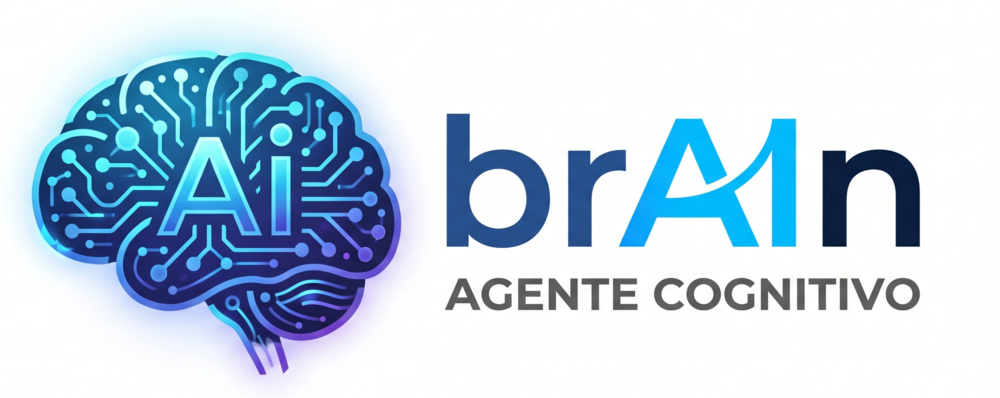

<p align="center">
  
</p>

# BrAIn — costruisci il tuo agente cognitivo da zero

> Un corso guidato dentro Claude Code che ti porta da una macchina vuota a un **agente cognitivo tuo**: che ti conosce, ricorda, scrive nella tua voce e impara nel tempo. Niente codice, niente terminale: parli, e lui costruisce.

---

## Cos'è un "agente cognitivo" (in parole povere)

Un normale assistente AI è una **chat smemorata**. Apri, chiedi, rispondi, chiudi. Domani riapri e non sa più niente di te: non ricorda i tuoi clienti, non conosce il tuo lavoro, non scrive come scrivi tu. Riparte da zero ogni volta.

Un **agente cognitivo** è la stessa AI, ma con uno **stato su disco**: una manciata di file di testo, sul tuo computer, che vengono ricaricati a ogni sessione. Quei file gli danno quattro cose che una chat non ha:

| | Chat normale | Agente cognitivo |
|---|---|---|
| **Memoria** | dimentica a fine sessione | ricorda fatti su persone e progetti |
| **Conoscenza** | sapere generico | la *tua* competenza, scritta una volta |
| **Voce** | tono medio da AI | scrive come scrivi tu |
| **Capacità** | rispondi e basta | comandi tuoi che fanno cose tue |

Non è un prodotto da comprare. È un **modo di organizzare dei file** che BrAIn ti insegna a costruire, pezzo per pezzo, sul tuo dominio e coi tuoi dati. Alla fine è roba tua: la leggi, la modifichi, la porti via.

## Cosa NON è

- **Non è magia e non è autonomo.** È uno strumento che curi tu. Può sbagliare, può inventare: sta a te correggerlo e tenerlo pulito.
- **Non è un'app con la spina.** Non c'è un cloud che lo gestisce. Sono file tuoi; se non li mantieni, marciscono.
- **Non ti sostituisce.** Ti fa da protesi: amplifica come lavori, non decide al posto tuo.

---

## Come funziona, in 30 secondi

L'agente vive in tre **layer**, tre cartelle con tre scopi diversi:

- **IDENTITÀ — chi è.** Chi sei, le regole con cui lavora, la tua conoscenza stabile, la tua voce.
- **CAPACITÀ — cosa fa.** I formati con cui produce e le *skill* (i comandi `/qualcosa`) che orchestrano tutto.
- **MEMORIA & APPRENDIMENTO — come ricorda e impara.** I fatti che capitano, le tue preferenze, e tre modi di imparare.

Tutto è **testo leggibile**, niente database, niente formati chiusi. Apri un file e capisci cosa l'agente sa.

---

## Prerequisiti (onesti)

1. **Claude Code installato e funzionante:** https://claude.com/claude-code
2. **Un accesso a Claude attivo** (abbonamento o API). Claude Code parla con i modelli di Anthropic: senza accesso non funziona, e l'uso può avere un costo. Questo non dipende da BrAIn.
3. Saper **aprire Claude Code e scriverci dentro.** Nient'altro. Non serve git, non serve programmare.

Se non hai mai usato Claude Code: installalo, aprilo, scrivici "ciao". Quando ti risponde, sei pronto.

---

## Installazione

Il modo più veloce: apri Claude Code, **dagli lo zip del progetto** e scrivi `installa questa skill`. Fa tutto lui. Poi **chiudi e riapri** Claude Code (le skill si attivano al riavvio) e digita:

```
/learn
```

Dettagli e metodo manuale: vedi [`INSTALLA.md`](./INSTALLA.md).

---

## Il corso: `/learn`

`/learn` è una lezione **dal vivo, uno stage alla volta**. Tu scrivi `next`, parte lo stage successivo. Ogni stage segue lo stesso ritmo: ti **mostra** un esempio reale, ti **spiega** il perché in due frasi, **costruisce** il file sulla tua macchina (lo fa l'agente, non tu), e ti dice come **verificare** che funziona.

Undici stage (0 → 10) che costruiscono, in ordine:

```
Stage 0  · Setup & modello mentale     senti il problema: l'AI che dimentica, e perché
Stage 1  · CLAUDE.md                    la tua identità e le regole che sovrascrivono i default
Stage 2  · Memoria + /ricorda           un fatto = un file, e una scorciatoia per salvarli al volo
Stage 3  · Brain                        la tua conoscenza canonica (moduli + un indice che li sceglie)
Stage 4  · Tono & voce                  la tua voce, distillata da testi che ti piacciono
Stage 5  · Formati di scrittura         i tuoi template d'uscita riusabili
Stage 6  · Skill /scrivi                lega voce + formati + brain e produce  ← il picco
Stage 7  · Preferenze & feedback loop   l'agente impara come ti piace lavorare
Stage 8  · /decode                      impara da una fonte esterna (un documento, un appunto)
Stage 9  · /sogna                       impara dalle tue conversazioni passate, senza duplicare
Stage 10 · /backup & manutenzione       copie di sicurezza datate, e l'abitudine di consolidare
```

Puoi fermarti quando vuoi e riprendere con `/learn 6` (salti allo stage 6). `/learn map` mostra la mappa, `/learn handout` ti genera una guida da tenere.

Durata indicativa: ~8-10 minuti a stage dal vivo. Non è una corsa: è un'ora ben spesa una volta sola.

---

## I 6 comandi che ti restano

A fine corso hai sei comandi tuoi. Cinque li costruisci durante il corso, più `/learn` stesso.

### `/learn` — il corso
**Cosa fa:** la lezione guidata che costruisce tutto il resto.
**Quando:** all'inizio, e ogni volta che vuoi rivedere uno stage (`/learn 4`).

### `/ricorda` — salva un fatto al volo
**Cosa fa:** prende UNA cosa e la mette in memoria nel posto giusto, con la sua etichetta.
**Quando:** quando salta fuori un fatto che vuoi non dimenticare.
**Esempio:** `/ricorda il cliente Bianchi preferisce essere chiamato di mattina`
**Razionale:** scrivere a mano file e indici è una rottura; questo comando lo fa per te. È il modo *manuale* di imparare: un fatto per volta.

### `/scrivi` — produce nella tua voce
**Cosa fa:** scrive un testo unendo tre cose — la tua **voce**, un **formato** d'uscita, e i **fatti** dal tuo brain.
**Quando:** ogni volta che devi produrre qualcosa che suoni tuo.
**Esempio:** `/scrivi email-cliente aggiornamento sulla causa Rossi`
**Razionale:** è il senso di tutto. La conoscenza sta nel brain, la voce negli stili, la struttura nei formati; la skill è sottile e li orchestra. Cambi la voce in un posto, tutti i comandi la usano.

### `/decode` — impara da una fonte
**Cosa fa:** legge un documento o un appunto, ne estrae tutto, e lo smista: i fatti in memoria, il sapere stabile nel brain. Legge prima il file esistente e **somma**, non sovrascrive.
**Quando:** quando hai una fonte (un PDF, dei verbali, un articolo) che vuoi far interiorizzare all'agente.
**Esempio:** `/decode appunti-riunione-12-luglio.txt`
**Razionale:** è il modo di imparare *da fuori*. Così l'agente cresce nel tempo invece di ripartire da zero.

### `/sogna` — impara da sé stesso
**Cosa fa:** rilegge le tue conversazioni passate con Claude Code e ne distilla fatti e sapere, tenendo un registro di quelle già lavorate per non duplicare.
**Quando:** a fine giornata o ogni tanto, per consolidare quello che è emerso parlandoci.
**Esempio:** `/sogna`
**Razionale:** stesso motore di `/decode`, ma la fonte sei *tu*. È l'agente che impara mentre "dorme": tu chiudi, lui consolida.

### `/backup` — non perdere nulla
**Cosa fa:** salva tutto l'agente in uno zip datato in `~/claude-backups/`.
**Quando:** ogni tanto, e prima di fare modifiche grosse.
**Esempio:** `/backup`
**Razionale:** un agente è file di testo: se si rompono, vuoi la copia di ieri. Quegli zip puoi metterli su una chiavetta o nel cloud.

I tre modi di imparare: **`/ricorda`** (a mano, un fatto) · **`/decode`** (da una fonte) · **`/sogna`** (da te stesso).

---

## I razionali di fondo (perché è fatto così)

- **Tutto è testo, niente database.** Un file lo apri, lo leggi, lo correggi, lo cancelli. Niente è chiuso in un formato che non controlli. Trasparenza totale su cosa l'agente sa.
- **Un fatto = un file.** Granularità fine: correggi o butti un fatto sbagliato senza toccare gli altri. Un indice (`MEMORY.md`) tiene la lista, sempre caricata; i singoli file si pescano alla bisogna.
- **Memoria ≠ Brain.** La **memoria** ricorda *fatti che capitano* ("la causa di Rossi ha udienza il 12/07"). Il **brain** sa *cose che restano vere* ("come si struttura un parere"). Due scopi, due cartelle.
- **MERGE, mai sovrascrivere.** Quando l'agente impara, legge prima quello che c'è e **somma**. Non cancella il passato. Così cresce invece di ricominciare.
- **Poche regole vere.** Tre regole rispettate valgono più di venti ignorate. Vale per le regole dell'agente come per le tue preferenze.

---

## Buone norme

1. **Correggi a mano, senza paura.** Se l'agente sbaglia un fatto, apri il file e sistemalo. È testo tuo.
2. **Consolida spesso.** Lancia `/sogna` a fine giornata: l'agente salva da solo quello che avete imparato.
3. **Fai backup.** Un `/backup` ogni tanto e prima delle modifiche grosse. Tienine una copia fuori dal computer.
4. **Non gonfiare.** Più fatti non vuol dire agente migliore. Tieni la memoria pulita: i fatti vecchi o falsi vanno tolti.
5. **Una voce, distillata da esempi veri.** Non descrivere la tua voce a parole: dai all'agente 2-3 testi che ami e fagliela estrarre.

---

## I tuoi dati

L'agente vive **sul tuo disco**, come file di testo che possiedi tu: li leggi, li modifichi, li copi su una chiavetta, li cancelli. Non c'è un cloud che li tiene in ostaggio.

Onestà piena: durante una sessione, quello che scrivi all'agente viene comunque inviato ai modelli di Anthropic per funzionare (è così che Claude Code parla con l'AI). Ma la **memoria, la conoscenza e la voce** del tuo agente — il suo stato — restano file locali tuoi, non un account su un server altrui.

---

## Struttura dei file (cosa costruisci)

```
~/.claude/
├── CLAUDE.md          ← chi è e le regole
├── brain/             ← cosa sa (conoscenza stabile)
│   └── INDEX.md
├── styles/            ← come parla (la voce)
├── memory/            ← cosa ricorda (i fatti)
│   ├── MEMORY.md
│   └── preferences.md
├── skills/            ← cosa fa
│   ├── ricorda/  scrivi/  decode/  sogna/  backup/
└── (~/claude-backups/ ← le copie di sicurezza, fuori da qui)
```

---

## Licenza

MIT (consigliata). Vedi `LICENSE`.

## Crediti

Creato da [@lastknight](https://github.com/lastknight) (Matteo Flora). BrAIn è la versione didattica e da-zero del metodo con cui costruisce i propri agenti cognitivi.
